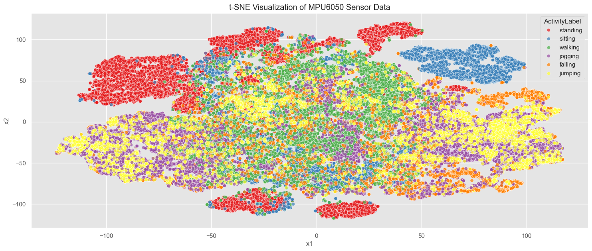
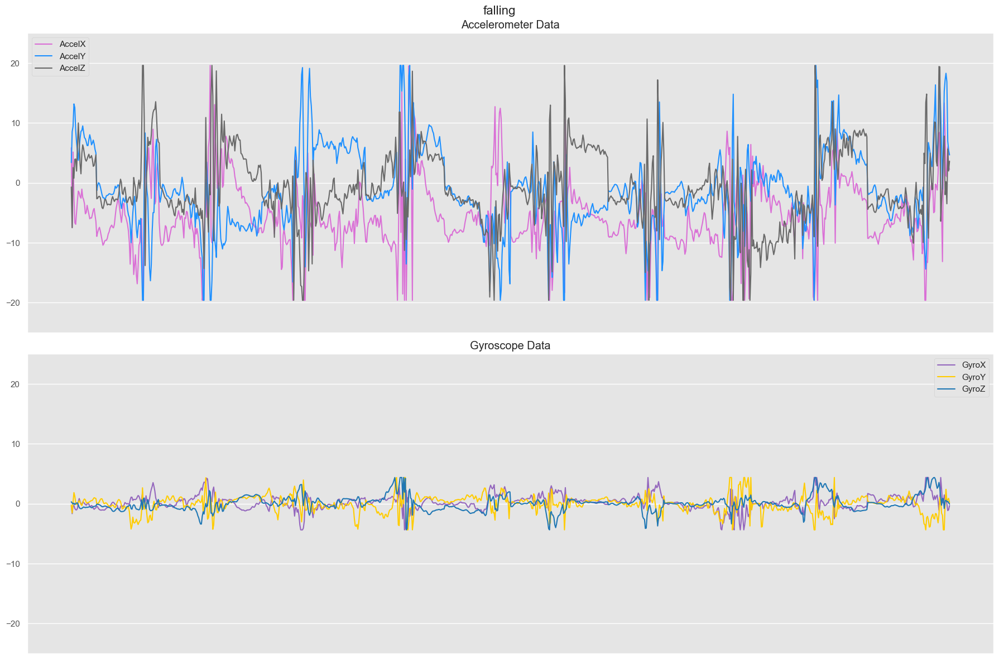
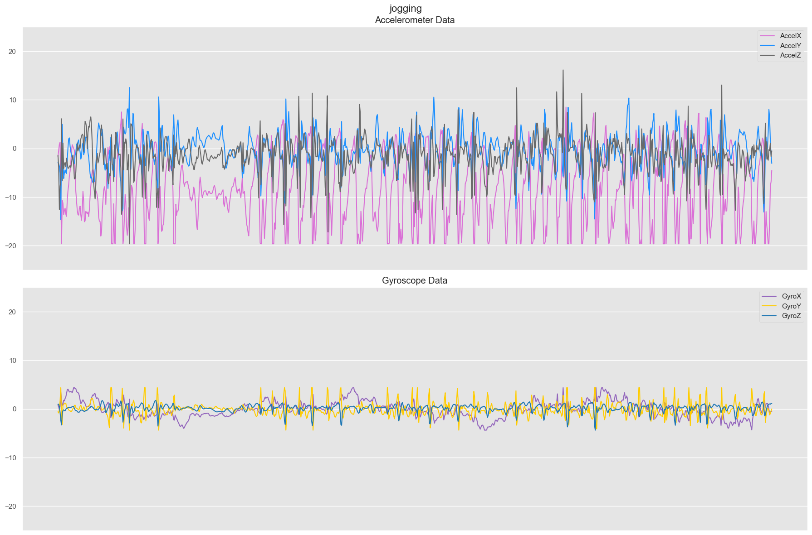
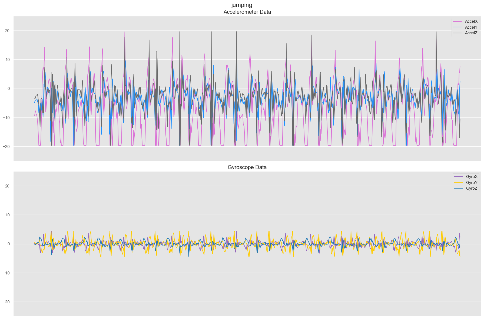
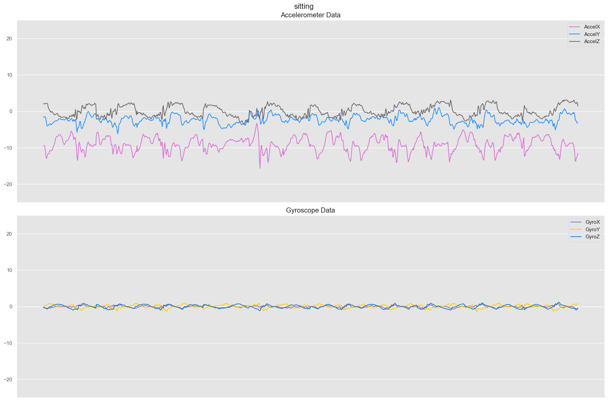
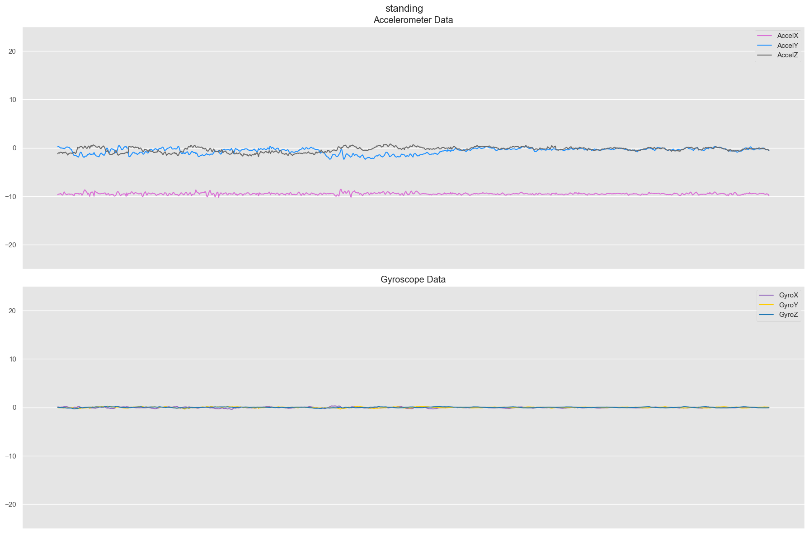
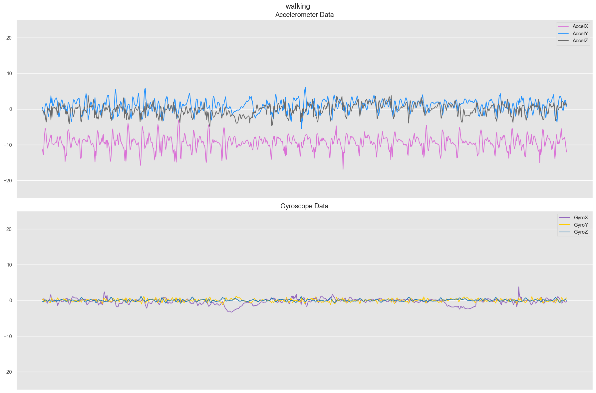
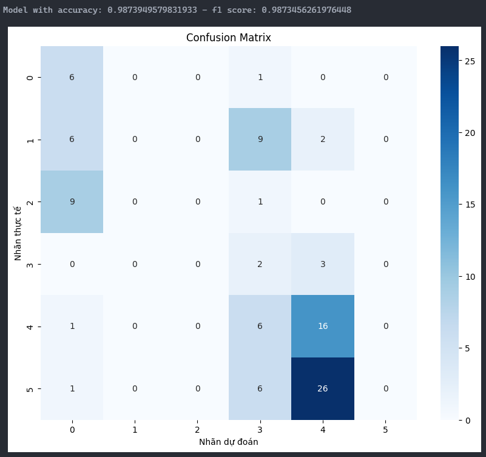

# Nhận Dạng Hành Động Con Người Bằng Cảm Biến MPU6050

Dự án này phát triển hệ thống Nhận dạng và phân loại các hành động của con người (đi bộ, chạy, nhảy, ngã, đứng yên, ngồi) từ dữ liệu cảm biến MPU6050. 
Ứng dụng trong nhiều lĩnh vực như giám sát an ninh, chăm sóc sức khỏe, và phân tích hành vi trong môi trường thông minh.
<p align="center">
    
</p>

## 📋 Tổng Quan

Hệ thống sử dụng mô hình Transformer để nhận diện hành động con người qua dữ liệu cảm biến MPU6050, kết hợp với giao diện web để hiển thị kết quả.

## 🔍 Thành Phần Chính

### 📱 ESP32 Microcontroller + MPU6050
- Thu thập dữ liệu gia tốc và con quay hồi chuyển
- Truyền dữ liệu qua websocket protocol

### 🖥️ Websocket Server
- Nhận các dữ liệu đầu vào từ MPU6050
- Xử lý và chuẩn hóa dữ liệu
- Áp dụng mô hình Transformer để phát hiện hành động
- Xử lý kết quả và gửi kết quả đến đầu ra

### 🌐 Flask Web UI
- Hiển thị thông tin sensor realtime
- Hiển thị kết quả phát hiện đối tượng
- Cung cấp giao diện biểu đồ dữ liệu gia tốc và con quay hồi chuyển

## ⚙️ Hướng Dẫn Cài Đặt

1. Clone repository này về máy:
   ```bash
   git clone https://github.com/rynxu2/Human-Activity-Recognition-Detection.git
   cd Human-Activity-Recognition-Detection
   ```

2. Cài đặt các thư viện Python cần thiết:
   ```bash
   pip install -r requirements.txt
   ```

3. Khởi động máy chủ:
   ```bash
   python run.py
   ```

4. Truy cập giao diện web tại địa chỉ server đã cấu hình

## 📁 Cấu Trúc Dự Án

```
Human-Activity-Recognition-Detection/
├── app/                                # Thư mục ứng dụng Flask
│   ├── __init__.py                     # Khởi tạo ứng dụng Flask
│   ├── routes.py                       # Flask routes
│   ├── static/                         # Thư mục tĩnh
│   │   ├── css/
│   │   │   └── style.css              # CSS tùy chỉnh
│   │   └── js/
│   │       └── main.js                 # WebSocket và xử lý biểu đồ
│   └── templates/                      # Flask templates
│       ├── base.html                   # Mẫu cơ sở
│       └── index.html                  # Bảng điều khiển chính
├── esp32_mpu6050/                      # ESP32 code
│   └── get_data_from_esp32.ino         # Thu thập dữ liệu MPU6050
│   └── esp32_mpu6050.ino               # Thu thập dữ liệu MPU6050 và gửi đến server
├── data/                               # ML models
│   ├── merged_data.csv                 # Data đã gộp và xử lý
│   └── initially
│       ├── ...                         # Data ban đầu của từng người
├── results/                            # Mô hình đã huấn luyện
│   └── StandardScaler/
│       └── TransformerModel_w100.pth   # Trọng số đã huấn luyện
├── config.py                           # Cài đặt cấu hình
├── run.py                              # Điểm vào chính
├── websocket_server.py                 # WebSocket server
├── train.py                            # Huấn luyện mô hình
└── requirements.txt                    # Phụ thuộc Python
```

## 🖥️ Huấn Luyện Mô Hình

1. Chỉnh sửa các thông số
   ```bash
   BATCH_SIZE
   EPOCHS
   # đường dẫn đến dữ liệu
   ```
4. Huấn luyện
   ```bash
   python train.py
   ```

## 📊 Dữ Liệu

Dữ liệu huấn luyện là tập dữ liệu riêng được thu thập bởi nhóm.
Gồm 6 nhãn: walking, jogging, standing, jumping, sitting, falling

## 🛠️ Công Nghệ Sử Dụng

- **Deep Learning**: PyTorch, Transformer
- **Backend**: Flask
- **Frontend**: HTML
- **Phân tích dữ liệu**: NumPy, Pandas, Matplotlib


## Tỷ lệ Train và Test
Dữ liệu của 6 đối tượng (tình nguyện viên) được thu ở tốc độ 50Hz thu được tổng 119165 samples:
 - falling: 9390 samples
 - jumping: 10646 samples
 - jogging: 23734 samples
 - sitting: 14676 samples
 - standing: 28376 samples
 - walking: 32343 samples

## Agenda

### 1. Phân tích dữ liệu (EDA)

- Trực quan hóa t-SNE của dữ liệu
<p align="center">
  
  <br>
  <em>Trực quan hóa t-SNE của dữ liệu</em>
</p>

- Phân tích phân phối dữ liệu
<p align="center">
  
  
  <br>
  <em>Phân tích phân phối dữ liệu</em>
</p>
<p align="center">
  
  
  <br>
  <em>Phân tích phân phối dữ liệu</em>
</p>
<p align="center">
  
  
  <br>
  <em>Phân tích phân phối dữ liệu</em>
</p>

### 3. Deep Learning Models:
Hệ thống sử dụng kiến trúc **Transformer**:
- **Transformer**: Được sử dụng để trích xuất và mô hình hóa mối quan hệ giữa các đặc trưng theo chuỗi thời gian, giúp nhận diện hoạt động chính xác hơn.
- **Pipeline**:
   + Dữ liệu được thu thập từ cảm biến MPU6050 (gia tốc kế và con quay hồi chuyển).
   + Chuỗi dữ liệu cảm biến được chia thành các đoạn thời gian cố định.
   + Transformer xử lý toàn bộ chuỗi dữ liệu bằng self-attention, giúp mô hình học được sự phụ thuộc dài hạn giữa các trạng thái của cơ thể.
   
###   4.	Kết quả
 - Độ chính xác của mô hình Transformer đạt được ~99% trên tập kiểm tra.
   

## 📝 Liên Hệ

gmail: dobaolong207@gmail.com

## 📜 Giấy Phép

[Thông tin giấy phép]

---